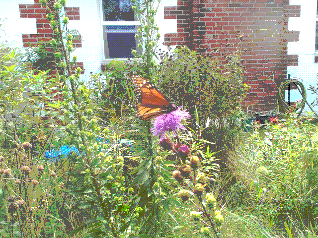

## Contents

- [Propagation](#propagation)
- [Rabbit Cottage Plantings](#rabbit-cottage-plantings)

## Propagation

**Seed Collection**: To collect _Liatris spp._ seeds, wait for the plant to finish blooming. The seedheads will be dry and brown and will fall right off the stalk if it's ripe. You can cut them a little early and let them finish drying in a paper bag.

**Seed Planting**: Prairie Moon says to cold moist stratify for 60 days.[^2]

**2026**: I did this with a plastic milkjug in winter 2026 and had a pretty low germination rate, then the squirrels ripped all the seedlings out in order to plant a black walnut in the jug. First attempt was a failure and had me seriously considering a varmint rifle. Lady Bird Johnson recommends scarification and 90 days of cold moist stratification, but that's for _L. spicata_.[^3] Growit Build references studies that 90+ days greatly increase germination rate.[^4] More interestingly, a reddit user lists very specific steps for _Liatris novae-angliae_ in Connecticut that seem worth following.[^5] The instructions are as follows:

1. 60 days cold moist stratification _in refrigerator in damp media_ so they don't freeze.
2. Surface-sow in April in 4" deep cells / pots in prepared as follows: "deep cells with coarse peat/perlite, tamped them and topped off 1/2" of fine germination mix."
3. Germination occurs in 10-21 days with bottom heat and even moisture, just shy of 80F.

**Division**: _Liatris spp._ grow from a corm which can be divided every few years.[^1] Divide in the fall after the foliage has yellowed.

## Rabbit Cottage Plantings

### _Liatris scariosa_, Northern Blazing Star, in the front yard

Acquired from Farmer's Daughter in 2026 in a perennial plant sale. There's no specific variety on the package, e.g. _var. nieuwlandii_, but it was listed as native Northern Blazing Star. I don't know whether it's actually _var. nieuwlandii_, _var. novae-angliae_ or just straight _L. scariosa_ but I am not sure it really matters - it's got the form I wanted, which is loose and conical spikes. Pollinators love it and as I write this at the end of September it contains 3 tall spikes - 4-5 ft - full of beautiful flower clusters.

It's far enough from the house that it's still getting full sun even with the low angle of the sun at the end of September (it's the 27th).

[^1]: <https://web.archive.org/web/20260414092321/https://plants.ces.ncsu.edu/plants/liatris/>. Accessed 2026-09-27.
[^2]: <https://www.prairiemoon.com/liatris-scariosa-var-nieuwlandii-northern-blazing-star#panel-planting>. Accessed 2026-09-27.
[^3]: <https://web.archive.org/web/20260921014022/https://www.wildflower.org/plants/result.php?id_plant=lisp>. Accessed 2026-09-27.
[^4]: <https://growitbuildit.com/how-to-germinate-liatris-seed/>. Accessed 2026-09-27.
[^5]: <https://web.archive.org/web/20260927130845/https://www.reddit.com/r/NativePlantGardening/comments/1wr68r5/liatris_novae_angliae_and_oclemena_x_blakei_grown/>. Accessed 2026-09-27.